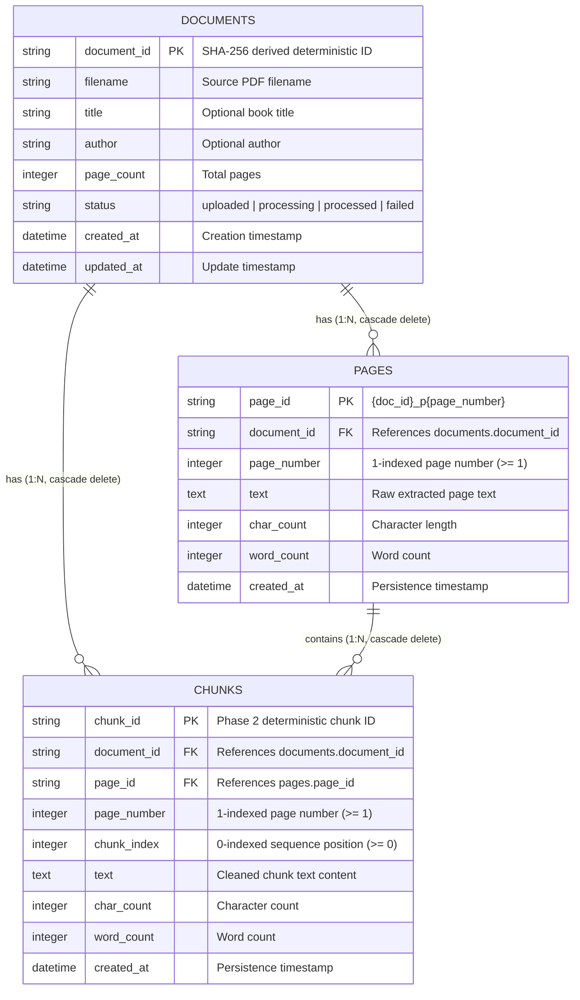

# BookRAG AI

A research-oriented, production-quality Retrieval-Augmented Generation (RAG) system engineered from first principles for querying and analyzing complete book manuscripts and multi-chapter documents.

---

## 1. What is BookRAG AI?

BookRAG AI is a modular RAG platform specifically tailored to the unique challenges of long-form literature and technical texts. Unlike simple document Q&A prototypes that slice text into naive fixed-size windows and rely on third-party black-box wrappers, BookRAG AI is designed to explicitly implement each component of the retrieval and generation pipeline.

Key capabilities planned for the platform include:
- Preserving page numbers, chapter hierarchies, and contextual book metadata.
- Intelligent document cleaning and structural chunking.
- Dense semantic vector embeddings preserving full chunk provenance.
- Exact vector retrieval using FAISS IndexFlatIP over unit-normalized dense vectors.
- Cross-encoder reranking for precision context selection.
- Dual-mode synthesis: **Extractive QA** (exact text citations) and **Abstractive QA** (synthesized reasoning).
- Groundedness validation and hallucination mitigation.
- Fine-grained question generation for readers, researchers, and students.
- Transparent relevance visualization via an interactive Relevant Matching Board.

> **Important**: This project intentionally does **not** rely on LangChain for its core RAG architecture. Each component is designed and implemented explicitly to ensure complete transparency, auditability, and control.

---

## 2. Why It Is Being Built

Most existing RAG demonstrations suffer from severe limitations when applied to full-length books:
1. **Loss of Book Context**: Long narratives and technical treatises span hundreds of pages. Naive chunking fragments ideas and disconnects citations from original pages.
2. **Framework Opacity**: High-level abstractions frequently hide chunk boundaries, vector distance metrics, prompt assemblies, and failure points.
3. **Hallucination & Ungrounded Answers**: Without strict groundedness validation and cross-encoder reranking, LLMs confidently produce incorrect citations.
4. **Shallow Evaluation**: Few systems provide verifiable benchmarks measuring precision, recall, and citation fidelity across complete books.

BookRAG AI addresses these issues through an explicit, modular, step-by-step engineering approach.

---

## 3. High-Level Architecture

The target end-to-end architecture is structured as a modular monolith:

```
[ User Browser / Frontend Client ]
               │
               ▼ (HTTP / REST)
     [ FastAPI Backend API ]
        │             │
        ▼             ▼
 [ Query Service ]   [ Document Processing Pipeline ]
        │                     │
        ▼                     ▼
 [ Reranker & QA ]     [ Ingestion → Cleaning → Chunking → Embeddings ]
        │                     │
        ▼                     ▼
 [ FAISS Vector Index (IndexFlatIP) / PostgreSQL + pgvector ]
```

### Architectural Layering:
- **API Layer (`backend/app/api/`)**: Thin controllers handling request validation, routing, and HTTP status codes.
- **Service Layer (`backend/app/services/`)**: Core domain workflows:
  - `services/pdf/`: Safe ingestion, validation, and page-aware PDF representation.
  - `services/text/`: Conservative text normalization and paragraph/sentence-aware intelligent chunking.
  - `services/embeddings/`: Dense semantic vector representations with device negotiation and provenance retention.
  - `services/retrieval/`: Exact vector indexing (FAISS IndexFlatIP), metadata mapping synchronization, document-isolated top-K search, and disk persistence.
- **Data & Repository Layer (`backend/app/repositories/` & `backend/app/models/`)**: Abstracted persistence for book metadata, chunks, and index mappings (reserved for future database phases).
- **Core Platform (`backend/app/core/`)**: Cross-cutting concerns including centralized settings, structured logging, and unified error handling.

---

## 4. Current Phase Scope: Phase 17 Complete

This repository has completed **Phase 0 (Foundation)**, **Phase 1 (PDF Ingestion)**, **Phase 2 (Text Cleaning & Chunking)**, **Phase 3 (Semantic Embeddings)**, **Phase 4 (Vector Retrieval with FAISS)**, **Phase 5 (Semantic Search Service & API)**, **Phase 6 (Cross-Encoder Reranking)**, **Phase 7 (Extractive Question Answering)**, **Phase 8 (Abstractive QA with FLAN-T5)**, **Phase 9 (Groundedness & Hallucination Control)**, **Phase 10 (Citation & Provenance Mapping Layer)**, **Phase 11 (Query Understanding & Query Planning)**, **Phase 12 (Controlled Question Generation & Validation)**, **Phase 13 (PostgreSQL Persistent Application Data)**, **Phase 14 (pgvector Persistent Vector Storage & Database-Native Vector Retrieval)**, **Phase 15 (Redis + Celery Background Processing)**, **Phase 16 (Production FastAPI Architecture)**, and **Phase 17 (React Frontend & Product UI)**.

### What is implemented:
- **Repository & Runtime Foundation (Phase 0)**:
  - Repository layout, virtual environment, and Git configuration.
  - Centralized settings with `pydantic-settings` and `.env.example`.
  - Configurable application logging and structured HTTP error handling.
  - Operational health check endpoint: `GET /api/v1/health`.
- **PDF Ingestion & Page-Aware Representation (Phase 1)**:
  - Low-level PDF parser abstraction using PyMuPDF (`pymupdf>=1.25.0`).
  - High-level `PDFIngestionService` for safe document opening, validation, and metadata extraction.
  - 1-based page numbering preserving page provenance for future citations.
  - Exact raw text extraction with per-page and document-wide character and word counts.
  - Extraction diagnostics identifying empty and low-text pages without crashing ingestion.
  - Controlled domain exceptions (`PDFNotFoundError`, `InvalidPDFError`, `PDFExtractionError`).
  - Deterministic document ID generation derived from content SHA-256 hashes.
- **Text Cleaning & Intelligent Chunking (Phase 2)**:
  - Conservative, deterministic `TextCleaner` with line-ending normalization, safe dehyphenation (`intel-\nligence` -> `intelligence`), compound word preservation (`state-of-the-art`), and whitespace normalization.
  - Paragraph-first, sentence-aware `Chunker` respecting `target_size` (1200), `max_size` (1600), and `overlap` (200).
  - Bounded semantic overlap between adjacent chunks on the same page.
  - Strict page boundaries: pages are chunked independently to prevent cross-page provenance ambiguity.
  - Deterministic, debuggable chunk IDs (`{document_id}_p{page_number:03d}_c{chunk_index:04d}`).
  - Non-destructive `TextProcessingService` keeping raw `Page.text` immutable.
- **Semantic Embeddings (Phase 3)**:
  - Real integration with `sentence-transformers/all-MiniLM-L6-v2` generating 384-dimensional dense vectors.
  - Single-load model lifecycle caching via `EmbeddingModel.get_instance()` avoiding redundant reloads.
  - Configurable device support with automatic negotiation: uses CUDA if available, seamlessly falls back to CPU.
  - Batch inference via `model.encode(texts, batch_size=32)` strictly preserving input order.
  - Vector normalization to unit length ($L_2 \approx 1.0$) for cosine similarity compatibility with FAISS.
  - `EmbeddingRecord` schema guaranteeing that chunk provenance (`chunk_id`, `document_id`, `page_number`) remains attached to every vector.
  - Raw `Chunk` objects remain completely immutable after embedding.
- **Vector Retrieval with FAISS (Phase 4)**:
  - `faiss.IndexFlatIP` integration computing exact inner products over $L_2$-normalized 384-dimensional dense vectors.
  - `VectorToChunkMapping` maintaining a synchronized, deterministic 1-to-1 correspondence between FAISS internal integer vector slots and source chunk provenance.
  - `VectorIndex` container managing FAISS index lifecycle, vector addition, dimension validation, and disk persistence (`.faiss` binary + `.json` metadata mapping).
  - `RetrievalService` orchestrator embedding natural language search queries with the identical Phase 3 embedding model and executing top-K nearest vector search.
  - Document isolation and filtering allowing queries to be restricted to specific book documents without cross-book pollution.
  - Structured, ranked `RetrievalResult` objects preserving complete provenance (`chunk_id`, `document_id`, `page_number`, `text`, `similarity_score`, `rank`).
  - Strict validation: rejects dimension mismatches, empty/whitespace queries, non-positive top_k, and corrupted metadata files.
- **Semantic Search Service & API (Phase 5)**:
  - Application-level `SearchService` orchestrating the retrieval pipeline.
  - Thin FastAPI endpoint: `POST /api/v1/search` with dependency injection.
  - Complete provenance preservation: `rank`, `chunk_id`, `document_id`, `page_number`, `text`, `similarity_score`, `chunk_index`, and `metadata`.
  - Document isolation and filtering with structured HTTP 404 for unknown documents.
  - Safe empty index handling returning empty results without crashing.
  - Public API contract abstraction hiding internal FAISS vector positions (`vector_index`).
- **Cross-Encoder Precision Reranking (Phase 6)**:
  - Two-stage retrieval pipeline: First-stage FAISS dense vector search retrieves a high-recall candidate pool (`candidate_k`, default 20); second-stage `CrossEncoder` (`cross-encoder/ms-marco-MiniLM-L-6-v2`) performs joint full-attention cross-scoring over `(query, passage)` pairs to select final high-precision results (`top_k`, default 5).
  - Dedicated `RerankerService` and `RerankerModel` with single-load model lifecycle caching.
  - Full provenance retention (`original_rank` alongside final `rank`).
- **Extractive Question Answering (Phase 7)**:
  - Extractive span-selection using `deepset/roberta-base-squad2`.
  - Sliding-window passage scoring with stride tokenization and SQuAD 2.0 unanswerability handling.
  - Public endpoint: `POST /api/v1/qa`.
- **Abstractive QA / Generation with FLAN-T5 (Phase 8)**:
  - Controlled abstractive answer synthesis using `google/flan-t5-base`.
  - Token-budgeted context assembly via `EvidenceBuilder` with strict evidence-only instructions.
  - Deterministic beam search generation without random sampling.
  - Public endpoint: `POST /api/v1/answer`.
- **Groundedness & Hallucination Control (Phase 9)**:
  - Cross-Encoder NLI model wrapper using `cross-encoder/nli-deberta-v3-base` with dynamic `id2label` discovery.
  - Deterministic `ClaimDecomposer` extracting sentence-level propositions with whitespace normalization.
  - Batch NLI inference evaluating premise (evidence passage) vs hypothesis (generated claim).
  - Four-state claim classification: `entailed`, `contradicted`, `unsupported`, and `conflicted`.
  - Transparent provenance tracking of supporting and contradicting evidence chunks.
  - Safe decision policy suppressing ungrounded or contradicted answers while preserving diagnostic claim breakdown and evidence provenance.
  - Dedicated public endpoint: `POST /api/v1/grounded-answer`.
- **Citation & Provenance Mapping Layer (Phase 10)**:
  - Deterministic `CitationService` translating verified NLI grounding evidence into response-local citation objects (`cite_1`, `cite_2`, ...).
  - Strict preservation of the core architectural principle: *"The generator generates the answer. The system assigns citations from verified evidence."*
  - Complete provenance retention (`citation_id`, `document_id`, `chunk_id`, `page_number`, `chunk_index`, unedited `source_text`, scores).
  - Many-to-many claim-to-citation relationships (one claim can have multiple citations; one chunk can support multiple claims).
  - Global citation deduplication using deterministic `(document_id, chunk_id)` keys.
  - Preservation of contradiction and conflict diagnostics (`relation="supports" | "contradicts"`) without converting refutations into false endorsements.
  - Strict document isolation enforcing single-document provenance boundaries per response.
  - Complete presentation-independence returning structured metadata for frontend UI rendering.
- **Query Understanding & Query Planning (Phase 11)**:
  - Explicit intermediate typed `QueryPlan` contract mediating between user query and retrieval.
  - Safe, non-destructive query normalization preserving technical symbols (`C++`), hyphenated compounds (`COVID-19`), ampersands (`R&D`), years, and numbers.
  - 10-type query classification taxonomy (`FACTUAL`, `DEFINITION`, `LIST`, `COMPARISON`, `CAUSAL`, `PROCEDURAL`, `LOCATION`, `SUMMARY`, `MULTI_HOP`, `UNKNOWN`).
  - Expected answer type inference (`PERSON/ENTITY`, `DATE/YEAR`, `LOCATION`, `NUMBER`, `EXPLANATION`, `LIST`, `COMPARISON`, `SUMMARY`, `DEFINITION`).
  - Strict constraint detection for explicit attributes only (`chapter`, `year`, `page`, `page_range`, `quoted_phrases`, `named_entities`) with no invented constraints.
  - Focused retrieval query generation: single query for simple questions, targeted multi-query decomposition (max 3) for comparisons and causal pairs.
  - `QuerySearchService` multi-query execution with candidate merging, stable deduplication by `(document_id, chunk_id)`, and full provenance retention.
  - Post-merge Cross-Encoder reranking over the unified candidate pool against the normalized query.
  - Dedicated debug/planning endpoint: `POST /api/v1/query-plan` and automatic `query_plan` inclusion in `POST /api/v1/grounded-answer`.
- **Controlled Question Generation & Validation (Phase 12)**:
  - Evidence-grounded, answer-first question generation conditioned on extracted answer candidate spans.
  - Dedicated local model wrapper `iarfmoose/t5-base-question-generator` with singleton caching, input formatting `<answer> {answer} <context> {context}`, and deterministic beam search.
  - Conservative `AnswerCandidateExtractor` extracting high-value answer candidates (entities, dates, years, numbers, technical terms) while strictly rejecting trivial stop words.
  - Extractive QA verification using RoBERTa SQuAD2 (`deepset/roberta-base-squad2`) to independently answer each generated question from source evidence.
  - Strict answer matching policy preserving numeric identity (e.g. 1998 != 1999) and rejecting unanswerable or conflicting candidates.
  - Question taxonomy classification (10 types: `FACTUAL`, `WHO`, `WHAT`, `WHEN`, `WHERE`, `WHY`, `HOW`, `HOW_MANY`, `DEFINITION`, `COMPARISON`).
  - Heuristic difficulty classification (`EASY`, `MEDIUM`, `HARD`).
  - Normalized exact duplicate detection within requests and across candidates.
  - Controlled count limits without fabrication: never fabricates questions if candidate pool is insufficient.
  - Dedicated public endpoint: `POST /api/v1/questions/generate`.
- **PostgreSQL Persistent Application Data (Phase 13)**:
  - PostgreSQL persistent system of record for book documents, pages, chunks, metadata, and relational hierarchy.
  - Strict architectural separation: PostgreSQL stores document structure, text, and metadata, while FAISS remains the dedicated high-performance vector retrieval index. (Embeddings are intentionally NOT stored in DB until Phase 14 pgvector).
  - SQLAlchemy 2.x declarative models (`Document`, `Page`, `Chunk`) with deterministic IDs, explicit referential foreign keys (`ondelete="CASCADE"`), unique constraints (`uq_pages_document_page_number`, `uq_chunks_document_page_chunk`), and check constraints.
  - Dedicated repository pattern isolation (`DocumentRepository`, `PageRepository`, `ChunkRepository`) preventing raw SQL and database logic from leaking into domain/ML services.
  - `DocumentPersistenceService` orchestrating atomic transactions with strict status lifecycle (`processing -> processed`), automatic rollback on failure, and zero partial/dirty state.
  - Reproducible Alembic migration workflow (`alembic upgrade head`, `alembic downgrade base`) managing schema versioning independently of application startup.
  - Public endpoints: `POST /api/v1/documents/ingest` (with transactional DB persistence), `GET /api/v1/documents`, `GET /api/v1/documents/{id}`, `GET /api/v1/documents/{id}/pages`, `GET /api/v1/documents/{id}/chunks`, and `DELETE /api/v1/documents/{id}`.
- **pgvector Persistent Vector Storage & Retrieval (Phase 14)**:
  - Database-native vector search via PostgreSQL `pgvector` extension and HNSW cosine distance index.
  - Abstract `VectorSearchBackend` providing interchangeable runtime backends (`faiss` and `pgvector`).
  - Seamless persistence of 384-dimensional chunk embeddings into PostgreSQL `chunks.embedding`.
- **Redis + Celery Background Processing (Phase 15)**:
  - Asynchronous document ingestion with Redis broker and Celery worker.
  - HTTP 202 Accepted upload lifecycle with durable status tracking (`queued -> processing -> processed/failed`).
  - Coarse processing stage tracking (`ingestion`, `chunking`, `persistence`, `embedding`, `indexing`, `completed`).
- **Production FastAPI Architecture (Phase 16)**:
  - Centralized dependency injection (`dependencies.py`) with cached ML singletons and request-scoped sessions.
  - ASGI Correlation ID middleware (`X-Request-ID`), structured sanitized error envelopes, and zero traceback leaks.
  - Thin API controllers and OpenAPI grouping.
- **React Frontend & Product UI (Phase 17)**:
  - Production-ready React 18 + TypeScript + Vite + Tailwind CSS single-page application.
  - End-to-end user journey: Document library dashboard, drag-and-drop PDF upload with HTTP 202 async acceptance, live status polling, book detail view, and grounded question answering.
  - Rich RAG display: Groundedness badge, NLI verification score, citation provenance tags, and expandable source evidence passages.
  - Strict error boundaries, user-friendly error banners with request ID details, keyboard accessibility (WCAG 2.1 AA), and responsive mobile/desktop layout.
- **Matching Board & Retrieval Transparency (Phase 18)**:
  - First-class retrieval transparency UI allowing users to inspect the internal mechanics of dense vector retrieval and Cross-Encoder precision reranking.
  - Transparent candidate-to-evidence progression: Displays exact user query, total candidates retrieved in Stage 1 (`candidate_count`), and final evidence passages selected in Stage 2.
  - Granular result cards displaying final rank, original retrieval rank, page number, semantic relevance score (vector cosine similarity), Cross-Encoder reranker score, and expandable passage text.
  - Deterministic ranking movement metric: $\Delta_{\text{rank}} = \text{original\_rank} - \text{final\_rank}$ indicating upward ($\uparrow$), downward ($\downarrow$), or unchanged position shifts caused by Cross-Encoder cross-attention.
  - Evidence-to-Answer provenance connection: Modal and inline triggers ("View Matching Board" / "Why these sources?") allowing users to trace generated answers directly to retrieved passages without executing duplicate backend retrieval.
  - Strict score semantics: Pure numeric representation with neutral labels ("Semantic relevance" and "Reranker relevance") preventing misleading percentage conversions or false "truth/accuracy" claims.
  - Accessible, responsive UI featuring KPI summary counters, filter tabs (All, Used in Answer, Promoted $\uparrow$), keyboard-navigable dialogs, and ARIA attributes.
  - Full test coverage: 16 frontend test cases and 3 backend transparency tests covering metadata preservation, ranking movement, score semantics, and zero regression.

---

## 5. Two-Stage Retrieval Architecture: Bi-Encoder vs. Cross-Encoder

BookRAG AI implements a classical information retrieval two-stage cascade:

```
User Query: "Why does backpropagation suffer from vanishing gradients?"
      │
      ▼
[Stage 1: Bi-Encoder (SentenceTransformers all-MiniLM-L6-v2)]
      │  Query embedding generated in isolation: vector ∈ R^384
      ▼
[FAISS IndexFlatIP Dense Retrieval]
      │  High-recall candidate pool search across entire book corpus
      ▼
Candidate Pool: candidate_k = 20 candidates (ranked by similarity_score)
      │
      ▼
[Stage 2: Cross-Encoder (ms-marco-MiniLM-L-6-v2)]
      │  Batched inference over (query, candidate_text) pairs
      │  Full cross-attention across all query and passage token pairs
      ▼
Candidate Scoring & Re-ranking:
      │  Candidates sorted by descending reranker_score
      │  original_rank preserved, new rank 1..N assigned
      ▼
Final Results: top_k = 5 high-precision evidence chunks
```

### Why Dense Retrieval is Used First
A complete book or technical manual can easily contain thousands of chunks. Passing thousands of candidate pairs into a heavy transformer model with full cross-attention for every incoming query would require thousands of forward passes and hundreds of milliseconds to seconds of latency per search request. Bi-encoder dense retrieval solves this by pre-computing chunk embeddings once and performing exact inner-product vector search in sub-millisecond time.

### Why Cross-Encoder Reranking is Needed
Bi-encoders embed queries and documents independently:
$$\text{sim}(q, d) = \cos(\mathbf{u}_q, \mathbf{v}_d)$$
Because the query and document cannot attend to each other during vector encoding, bi-encoders cannot capture complex cross-term interactions, query conditionality, or negative modifier dependencies.

Cross-encoders concatenate the query and passage into a single transformer input sequence:
$$\text{Input} = \text{[CLS]} \, q_1 \dots q_m \, \text{[SEP]} \, d_1 \dots d_n \, \text{[SEP]}$$
This allows every query token to attend to every document token across all transformer layers via bidirectional self-attention, yielding substantially higher relevance discrimination and context precision.

### Bi-Encoder vs. Cross-Encoder Comparison

| Dimension | Bi-Encoder (EmbeddingService) | Cross-Encoder (RerankerService) |
| :--- | :--- | :--- |
| **Model** | `all-MiniLM-L6-v2` | `ms-marco-MiniLM-L-6-v2` |
| **Input Structure** | Query alone $\rightarrow \mathbf{u}$; Document alone $\rightarrow \mathbf{v}$ | Joint pair: `(query, passage)` |
| **Attention Mechanism** | Independent intra-sequence self-attention | Full cross-attention across query and passage tokens |
| **Computation Speed** | Extremely fast ($O(1)$ vector distance lookup) | Slower forward pass per candidate pair |
| **Primary Role** | First-stage high-recall candidate retrieval | Second-stage high-precision candidate reranking |
| **Input Scope** | Entire corpus of book chunks | Candidate pool of size `candidate_k` |

### Candidate_k vs. Final Top_k
- `candidate_k` (default: 20): Determines the size of the high-recall pool retrieved from FAISS. A larger candidate pool gives the cross-encoder a richer set of semantically diverse candidates to evaluate.
- `top_k` (default: 5): Determines the final number of top-ranked evidence chunks returned to the caller after cross-encoder reordering.
- Constraint: `candidate_k` must always be greater than or equal to `top_k`.

### Strict Score Semantics
- `similarity_score`: Inner-product cosine similarity from first-stage dense retrieval ($[-1.0, 1.0]$ for unit-normalized vectors). Measures vector-space proximity between isolated embeddings.
- `reranker_score`: Continuous logit score output by the cross-encoder transformer for joint `(query, passage)`.
- **CRITICAL NOTE**: Neither score represents answer confidence, probability of truth, factual correctness, or hallucination metrics. They measure semantic relevance in their respective retrieval stages.

---

## 6. Extractive Question Answering (Phase 7)

Phase 7 introduces an extractive Question Answering layer on top of the two-stage retrieval pipeline. Rather than generating or hallucinating synthetic text, the system extracts the exact token span from the retrieved book evidence that answers the user's question.

### Architectural Pipeline

```
User Query
    │
    ▼
EmbeddingService (Bi-Encoder: all-MiniLM-L6-v2)
    │  Generates 384-d normalized query vector
    ▼
FAISS Dense Retrieval (Stage 1: High Recall)
    │  Retrieves candidate_k candidate chunks (default: 20)
    ▼
Cross-Encoder Reranker (Stage 2: High Precision)
    │  Joint query-passage transformer scoring (ms-marco-MiniLM-L-6-v2)
    ▼
Top Evidence Selection (Top-N Chunks)
    │  Passes top_k reranked evidence chunks to QA service
    ▼
Extractive QA Service (Stage 3: Span Extraction)
    │  Hugging Face AutoModelForQuestionAnswering (deepset/roberta-base-squad2)
    │  Sliding-window tokenization with overflow stride (512 max_length, 128 stride)
    │  SQuAD 2.0 unanswerable thresholding (score_diff > threshold)
    ▼
Best Answer Span with Complete Provenance
    ├── answer: "1998"
    ├── answer_start / answer_end character offsets in source chunk text
    ├── chunk_id, document_id, page_number, chunk_index
    └── similarity_score, reranker_score, qa_score
```

### Why Extractive QA with RoBERTa SQuAD2?
- **Factual Integrity**: Extractive QA copies text spans directly from the source book; it cannot hallucinate non-existent facts, make up dates, or invent citations.
- **The Evidence is the Truth**: The book is the authoritative ground truth. If the book does not contain the answer, the system explicitly reports the question as unanswerable.
- **SQuAD 2.0 Unanswerability**: `deepset/roberta-base-squad2` is fine-tuned on SQuAD 2.0, which includes negative (unanswerable) questions. Token 0 (`<s>`) represents the null/no-answer token with score `start_logits[0] + end_logits[0]`.

### Sliding-Window Overflow Handling
Books contain long context passages that frequently exceed a transformer's maximum token limit (512 tokens). Rather than truncating away critical evidence:
1. Long passages are split into overlapping context windows using `stride=128`.
2. Offset mappings and `sequence_ids` ensure answer spans are selected exclusively from context tokens (`sequence_id == 1`), never special tokens or question tokens.
3. Candidate spans are evaluated across all sliding windows of all evidence chunks.
4. Token start and end indices are converted back to exact character offsets (`answer_start`, `answer_end`) in the original uncompressed source text.

### Unified Score Semantics

| Metric | Origin | Meaning | What It Does NOT Mean |
| :--- | :--- | :--- | :--- |
| `similarity_score` | Bi-Encoder (Stage 1) | Cosine similarity in dense vector space | NOT probability, NOT factual truth |
| `reranker_score` | Cross-Encoder (Stage 2) | Joint transformer relevance logit | NOT confidence, NOT factual correctness |
| `qa_score` | RoBERTa SQuAD2 (Stage 3) | Extractive span logit ($s_{\text{start}} + s_{\text{end}}$) | NOT answer accuracy, NOT confidence % |
| `no_answer_score` | RoBERTa SQuAD2 (Stage 3) | Logit for the null/unanswerable token ($s_0$) | NOT probability of non-existence |

> **IMPORTANT PRINCIPLE**: None of these scores represents factual correctness, answer confidence, or hallucination metrics. The retrieved passage is the sole source of truth; the QA model simply identifies which span within the retrieved evidence best matches the query.

---

## 7. Abstractive Question Answering (Phase 8)

Phase 8 introduces controlled abstractive text generation using `google/flan-t5-base`. While Phase 7 extracts verbatim substrings from the retrieved text, Phase 8 synthesizes fluent, comprehensive natural language answers that integrate evidence across multiple passages or reformulate complex explanations.

### Architectural Pipeline

```
User Query
    │
    ▼
EmbeddingService (Bi-Encoder: all-MiniLM-L6-v2)
    │  Generates 384-d normalized query vector
    ▼
FAISS Dense Retrieval (Stage 1: High Recall)
    │  Retrieves candidate_k candidate chunks (default: 20)
    ▼
Cross-Encoder Reranker (Stage 2: High Precision)
    │  Joint query-passage transformer scoring (ms-marco-MiniLM-L-6-v2)
    ▼
Top Evidence Selection (Top-N Chunks)
    │  Passes top_k reranked evidence chunks to Generation pipeline
    ▼
EvidenceBuilder (Context Budgeting & Grounding)
    │  Enforces GENERATION_MAX_INPUT_TOKENS (default: 2048)
    │  Formats passages with explicit boundaries: [Page X] <text>
    │  Prioritizes higher-ranked chunks, carefully truncating oversized candidates
    ▼
FLAN-T5 Generation (Stage 3: Abstractive Synthesis)
    │  Hugging Face AutoModelForSeq2SeqLM (google/flan-t5-base)
    │  Controlled deterministic beam search (do_sample=False, num_beams=4)
    ▼
Synthesized Answer with Full Evidence Provenance
    ├── answer: "Backpropagation computes gradient vectors through recursive application of the chain rule..."
    ├── answerable: true
    ├── model_name: "google/flan-t5-base"
    ├── evidence: [ { rank, chunk_id, document_id, page_number, similarity_score, reranker_score, ... } ]
    └── evidence_count: 2
```

### Extractive vs. Abstractive QA

| Dimension | Extractive QA (Phase 7) | Abstractive QA (Phase 8) |
| :--- | :--- | :--- |
| **Model** | `deepset/roberta-base-squad2` | `google/flan-t5-base` |
| **Model Type** | Encoder-only (`AutoModelForQuestionAnswering`) | Encoder-Decoder Seq2Seq (`AutoModelForSeq2SeqLM`) |
| **Output Type** | Exact substring slice from source text | Synthesized natural language sentence/paragraph |
| **Answer Boundary** | Fixed character offsets (`answer_start`, `answer_end`) | Newly generated token sequence |
| **Multi-chunk Synthesis** | Selects best single span from highest-scoring chunk | Integrates and summarizes information across multiple chunks |
| **Hallucination Risk** | Zero (impossible to output words not in evidence) | Non-zero (controlled via grounded prompt and evidence restriction) |
| **Source of Truth** | Book evidence chunk | Book evidence chunk |

### Prompt Grounding and Controlled Template
To prevent the model from answering out of its pre-trained parametric memory, FLAN-T5 is conditioned with a deterministic prompt:

```text
Answer the question using only the provided context.

Context:
[Page 12] Rumelhart, Hinton, and Williams popularized backpropagation in 1986...

[Page 15] Backpropagation enables training deep networks by computing gradients...

Question:
How did backpropagation impact neural network training?

Answer:
```

### Context Budgeting & Token Management
- `GENERATION_MAX_INPUT_TOKENS=2048`: Upper token limit on the combined prompt (template instructions + question + evidence context).
- **Greedy Priority Ordering**: Evidence chunks are processed in descending rank order. As many complete chunks are accommodated as fit within the budget.
- **Graceful Truncation**: If a single top-priority chunk exceeds the available budget, it is carefully truncated with an ellipsis while retaining its full provenance metadata (`chunk_id`, `page_number`, `similarity_score`, `reranker_score`).
- **Empty Evidence Guard**: If no retrieved evidence is available, the system immediately returns a structured no-answer (`answerable=false`, `answer=null`) without invoking FLAN-T5.

### Explicit Semantic Principles
1. **The Book is the Source of Truth**: FLAN-T5 is an answer synthesis tool conditioned on retrieved text, NOT an independent factual authority.
2. **Unsupported Statements**: While prompt constraints heavily reduce hallucination, generative models can still synthesize unsupported statements.
3. **No False Confidence**: Generation output must never be interpreted as factual confidence or probability of truth.
4. **Phase 9 Boundary**: Formal NLI-based groundedness verification and automated hallucination scoring are explicitly reserved for Phase 9.

---

## 8. Technology Stack


### Backend (Current Phase 6):
- **Language**: Python 3.11+ (Tested on Python 3.13.7)
- **Web Framework**: [FastAPI](https://fastapi.tiangolo.com/) (>= 0.115.0)
- **ASGI Server**: [Uvicorn](https://www.uvicorn.org/) (>= 0.32.0)
- **PDF Extraction**: [PyMuPDF](https://pymupdf.readthedocs.io/) (>= 1.25.0)
- **Bi-Encoder Embeddings**: [Sentence Transformers](https://www.sbert.net/) (`sentence-transformers/all-MiniLM-L6-v2`), PyTorch (>= 2.2.0)
- **Cross-Encoder Reranker**: [Sentence Transformers CrossEncoder](https://www.sbert.net/docs/pretrained_cross-encoders.html) (`cross-encoder/ms-marco-MiniLM-L-6-v2`)
- **Vector Indexing & Retrieval**: [FAISS](https://github.com/facebookresearch/faiss) (`faiss-cpu>=1.9.0`)
- **Configuration & Validation**: [Pydantic v2](https://docs.pydantic.dev/) & [pydantic-settings](https://docs.pydantic.dev/latest/concepts/pydantic_settings/)
- **Testing**: [pytest](https://docs.pytest.org/) & [HTTPX](https://www.python-httpx.org/)

### Future Planned Stack:
- **Frontend**: React, TypeScript, Vite, TailwindCSS
- **Generative QA**: Extractive QA and Abstractive LLM synthesis
- **Vector Storage**: PostgreSQL + pgvector (for persistent production deployment)
- **Task Queues**: Redis & Celery
- **Infrastructure**: Docker & Docker Compose

---

## 6. Project Structure

```
BookRAG-AI/
│
├── backend/
│   ├── app/
│   │   ├── api/
│   │   │   └── v1/
│   │   │       ├── endpoints/
│   │   │       │   ├── __init__.py
│   │   │       │   ├── chunks.py          # POST /api/v1/chunks/clean & chunk-page
│   │   │       │   ├── documents.py       # POST /api/v1/documents/ingest
│   │   │       │   ├── embeddings.py      # POST /api/v1/embeddings/embed-chunk & embed-chunks
│   │   │       │   ├── health.py          # GET /api/v1/health implementation
│   │   │       │   ├── retrieval.py       # POST /api/v1/retrieval/index & search
│   │   │       │   └── search.py          # POST /api/v1/search (Phase 5 search endpoint)
│   │   │       ├── __init__.py
│   │   │       └── router.py              # Assembles version 1 routes
│   │   ├── core/
│   │   │   ├── __init__.py
│   │   │   ├── config.py                  # Pydantic BaseSettings management
│   │   │   ├── errors.py                  # Safe global & domain exception handlers
│   │   │   └── logging.py                 # Standardized logging setup
│   │   ├── models/                        # Domain entities (Reserved for future DB models)
│   │   ├── repositories/                  # Persistence repositories (Future phase)
│   │   ├── schemas/
│   │   │   ├── __init__.py
│   │   │   ├── chunk.py                   # Chunk, ChunkingConfig models
│   │   │   ├── citation.py                # Citation, ClaimCitationRef, CitationMappingResult (Phase 10)
│   │   │   ├── document.py                # Document, Page, Metadata Pydantic models
│   │   │   ├── embedding.py               # EmbeddingRecord, EmbeddingConfig models
│   │   │   ├── generation.py             # GenerationRequest, GenerationResponse (Phase 8)
│   │   │   ├── grounding.py              # GroundedAnswerRequest, GroundingReport, ClaimResult (Phase 9)
│   │   │   ├── health.py                  # Health check Pydantic schemas
│   │   │   ├── qa.py                      # QARequest, QAResponse (Phase 7)
│   │   │   ├── retrieval.py               # RetrievalResult, IndexMetadata, VectorMappingItem
│   │   │   └── search.py                  # SearchRequest, SearchResponse, SearchResult (Phase 5)
│   │   ├── services/
│   │   │   ├── __init__.py
│   │   │   ├── citation/                  # Phase 10 Citation & Provenance Mapping Service
│   │   │   │   ├── __init__.py
│   │   │   │   ├── exceptions.py          # Citation & DocumentIsolationError exceptions
│   │   │   │   └── service.py             # CitationService deterministic deduplication
│   │   │   ├── generation/                # Phase 8 Abstractive QA Generation Service
│   │   │   │   ├── __init__.py
│   │   │   │   ├── exceptions.py
│   │   │   │   ├── model.py               # FLAN-T5 Seq2Seq model wrapper
│   │   │   │   └── service.py             # GenerationService & EvidenceBuilder
│   │   │   ├── grounding/                 # Phase 9 Groundedness & Hallucination Control
│   │   │   │   ├── __init__.py
│   │   │   │   ├── claims.py              # Deterministic ClaimDecomposer
│   │   │   │   ├── exceptions.py
│   │   │   │   ├── model.py               # DeBERTa-v3 CrossEncoder NLI wrapper
│   │   │   │   ├── orchestrator.py        # GroundedAnswerService end-to-end pipeline
│   │   │   │   └── service.py             # GroundingService pair validation
│   │   │   ├── pdf/                       # Phase 1 Ingestion Service
│   │   │   │   ├── __init__.py
│   │   │   │   ├── exceptions.py          # Domain-specific PDF ingestion exceptions
│   │   │   │   ├── ingestion.py           # Orchestration, validation, diagnostics
│   │   │   │   └── parser.py              # PyMuPDF-specific extraction mechanics
│   │   │   ├── qa/                        # Phase 7 Extractive QA Service
│   │   │   │   ├── __init__.py
│   │   │   │   ├── exceptions.py
│   │   │   │   ├── model.py               # RoBERTa SQuAD2 model wrapper
│   │   │   │   └── service.py             # QAService sliding window span extraction
│   │   │   ├── reranking/                 # Phase 6 Cross-Encoder Reranking Service
│   │   │   │   ├── __init__.py
│   │   │   │   ├── exceptions.py
│   │   │   │   ├── model.py               # Cross-Encoder MiniLM model wrapper
│   │   │   │   └── service.py             # RerankerService precision re-scoring
│   │   │   ├── text/                      # Phase 2 Text Processing Service
│   │   │   │   ├── __init__.py
│   │   │   │   ├── chunker.py             # Paragraph & sentence-aware intelligent chunker
│   │   │   │   ├── cleaner.py             # Conservative deterministic text cleaner
│   │   │   │   ├── exceptions.py          # Text processing domain exceptions
│   │   │   │   └── processor.py           # Document-level multi-page text processing
│   │   │   ├── embeddings/                # Phase 3 Semantic Embeddings Service
│   │   │   │   ├── __init__.py
│   │   │   │   ├── exceptions.py          # Embedding domain exceptions
│   │   │   │   ├── model.py               # EmbeddingModel wrapper & instance registry
│   │   │   │   └── service.py             # EmbeddingService & batch inference
│   │   │   ├── retrieval/                 # Phase 4 FAISS Vector Retrieval Service
│   │   │   │   ├── __init__.py
│   │   │   │   ├── exceptions.py          # Retrieval & FAISS domain exceptions
│   │   │   │   ├── index.py               # VectorIndex wrapper & persistence
│   │   │   │   ├── mapping.py             # VectorToChunkMapping synchronization
│   │   │   │   └── service.py             # RetrievalService query search orchestrator
│   │   │   └── search/                    # Phase 5 Application Search Service
│   │   │       ├── __init__.py
│   │   │       ├── exceptions.py          # Search domain exceptions
│   │   │       └── service.py             # SearchService query orchestrator
│   │   ├── __init__.py
│   │   └── main.py                        # FastAPI application entry point
│   │
│   ├── tests/
│   │   ├── __init__.py
│   │   ├── conftest.py                    # Pytest client and deterministic PDF fixtures
│   │   ├── fixtures/
│   │   │   ├── __init__.py
│   │   │   └── pdf_factory.py             # Synthetic, reproducible PDF generators
│   │   ├── test_citation.py               # Phase 10 citation mapping, deduplication & isolation tests
│   │   ├── test_embeddings.py             # Phase 3 embedding inference, normalization, batch tests
│   │   ├── test_generation.py             # Phase 8 FLAN-T5 abstractive generation tests
│   │   ├── test_grounding.py              # Phase 9 NLI groundedness and hallucination tests
│   │   ├── test_health.py                 # Startup and health check tests (Phase 0)
│   │   ├── test_pdf_ingestion.py          # Phase 1 ingestion, validation, and API tests
│   │   ├── test_qa.py                     # Phase 7 RoBERTa extractive QA tests
│   │   ├── test_reranking.py              # Phase 6 Cross-Encoder reranking tests
│   │   ├── test_retrieval.py              # Phase 4 FAISS index, top-k search, mapping, persistence tests
│   │   ├── test_search.py                 # Phase 5 SearchService & API tests
│   │   └── test_text_processing.py        # Phase 2 cleaning, chunking, and overlap tests
│   ├── requirements.txt                   # Project dependencies
│   └── .env.example                       # Non-sensitive configuration template
│
├── frontend/                              # Reserved for future React application
│
├── data/                                  # Runtime data directories (version controlled via .gitkeep)
│   ├── uploads/                           # Destination for uploaded book PDFs
│   ├── processed/                         # Destination for extracted/chunked artifacts
│   └── indexes/                           # Destination for saved FAISS indexes & metadata JSON
│
├── docs/                                  # Architectural specifications and design records
├── evaluation/                            # Benchmarking datasets and evaluation scripts
│
├── .gitignore                             # Ignore rules for caches, env, data, models, *.pdf
├── README.md                              # Project documentation
└── docker-compose.yml                     # Minimal deployment skeleton for future phases
```

---

## 7. Vector Retrieval Pipeline (Phase 4)

```
User Query ("How do neural networks learn features?")
       │
       ▼
[ EmbeddingService.embed_query(query) ]
       │
       ▼
384-dimensional L2-normalized Query Vector (||q|| ≈ 1.0)
       │
       ▼
[ FAISS IndexFlatIP Search (top_k = 5) ]
   ├── Exact inner product computation: S(q, d) = q · d
   ├── Document isolation / filter check (document_id = "doc_ai")
   └── Returns top-K nearest slots & inner product distances
       │
       ▼
[ VectorToChunkMapping ]
   ├── Slot 0 -> doc_ai_p001_c0001 (Page 1)
   ├── Slot 1 -> doc_ai_p002_c0002 (Page 2)
   └── Synchronizes integer slot with complete chunk provenance
       │
       ▼
[ Structured RetrievalResult[] ]
   ├── Rank 1: Chunk doc_ai_p002_c0002 (Score: 0.812, Page: 2)
   ├── Rank 2: Chunk doc_ai_p001_c0001 (Score: 0.745, Page: 1)
   └── Complete text and provenance attached!
```

### Why FAISS IndexFlatIP?
`faiss.IndexFlatIP` computes the exact inner product between vectors with brute-force precision. Because all document chunk vectors and query vectors are $L_2$-normalized to unit length ($\|v\|_2 = 1.0$), the inner product mathematically equals the **cosine similarity**:

$$\text{Cosine Similarity}(q, d) = \frac{q \cdot d}{\|q\|_2 \|d\|_2} = q \cdot d = \text{Inner Product}(q, d)$$

This provides an exact, uncompressed baseline search without quantization distortions (such as IVF or PQ).

### Understanding Similarity Scores
- **Ranking Signal**: Similarity scores indicate relative semantic closeness between the query and candidate passages.
- **Not a Probability**: A score of `0.85` does not mean 85% probability or confidence.
- **Not Factual Correctness**: Semantic proximity does not guarantee that a text chunk contains a factually accurate answer to the question. Reranking and groundedness evaluation are applied in subsequent phases.

### Persistence Format
Persisted vector indexes are stored as two co-located files:
1. `<base_name>.faiss`: Binary serialized FAISS index structure.
2. `<base_name>.json`: Structured JSON containing index metadata (`dimension`, `model_name`, `total_vectors`, `document_ids`, `normalized`) and contiguous `VectorMappingItem` records.

---

---

## 8. Groundedness & Hallucination Control (Phase 9)

### The Purpose of Groundedness in BookRAG AI
> **"The NLI validator checks whether generated claims are supported by retrieved book evidence. It is not a general-purpose factual truth detector."**

A fundamental principle in technical RAG systems is distinguishing **groundedness** from **objective factual correctness**:
- **Groundedness**: Does the claim logically follow from (is it entailed by) the specific text passages retrieved from the indexed book?
- **Factual Correctness**: Is the statement an objective truth about the physical universe?

BookRAG AI operates as a retrieval and question-answering assistant for **books**. The book's retrieved evidence is the source of truth for the system. The NLI model evaluates whether the generative model synthesized an answer strictly faithful to the book passages, or whether it extrapolated unsupported propositions (hallucination).

### The Grounded Question Answering Pipeline
```
User Query
    ↓
SearchService (FAISS Dense Retrieval + Cross-Encoder Precision Reranking)
    ↓
Retrieved Evidence Passages
    ↓
GenerationService (FLAN-T5 Abstractive Synthesis)
    ↓
Raw Generated Answer
    ↓
ClaimDecomposer (Deterministic Sentence-Level Proposition Extraction)
    ↓
NLI Pair Construction (Premise = Evidence Passage, Hypothesis = Extracted Claim)
    ↓
NLIModel (cross-encoder/nli-deberta-v3-base Batched Forward Pass)
    ↓
Claim-Level Classification (Entailed / Contradicted / Conflicted / Unsupported)
    ↓
Safe Decision Policy (All claims supported? Contradictions present?)
    ↓
Safe Final Response (Grounded Answer OR Safe Refusal with Diagnostic Metadata)
```

### Natural Language Inference (NLI) Model
We employ `cross-encoder/nli-deberta-v3-base` through `sentence_transformers.CrossEncoder`:
- **Dynamic Label Discovery**: Rather than hardcoding class indices, the wrapper inspects `model.config.id2label` at load time to dynamically discover class mappings for:
  - `entailment`: The evidence passage logically guarantees or strongly supports the claim.
  - `contradiction`: The evidence passage directly refutes or is incompatible with the claim.
  - `neutral`: The evidence passage provides insufficient information to confirm or deny the claim.
- **Inference Mode & Caching**: Models are loaded once per process using thread-safe singleton caching under `torch.inference_mode()`.

### Deterministic Claim Decomposition
Before validation, generated answers are split into verifiable claim propositions using `ClaimDecomposer`:
- Splits text along sentence boundaries (`[.!?]\s+`).
- Normalizes whitespace (collapsing tabs, internal newlines, and multi-spaces).
- Filters out empty fragments and fragments shorter than `GROUNDING_MIN_CLAIM_LENGTH` (default: 3 characters).
- Assigns deterministic 0-based claim indices (`claim_index`).
- **Known Limitations**: Sentence splitting is a deterministic heuristic. Compound sentences containing multiple independent clauses are evaluated as a single claim unit.

### Claim-Level Classification Logic
For each extracted claim $c$ and top retrieved evidence chunks $E = \{e_1, \dots, e_K\}$:
1. Every `(e_i.source_text, c.claim_text)` pair is evaluated in batched NLI inference.
2. The strongest entailment score $e_{\max}$ and strongest contradiction score $c_{\max}$ across all evidence passages are identified along with source provenance.
3. Decision criteria using thresholds $\tau_e$ (`GROUNDING_ENTAILMENT_THRESHOLD=0.80`) and $\tau_c$ (`GROUNDING_CONTRADICTION_THRESHOLD=0.80`):
   - **`entailed`**: $e_{\max} \ge \tau_e$ AND $c_{\max} < \tau_c$.
   - **`contradicted`**: $c_{\max} \ge \tau_c$ AND $e_{\max} < \tau_e$.
   - **`conflicted`**: $e_{\max} \ge \tau_e$ AND $c_{\max} \ge \tau_c$ (different book passages present contradictory statements).
   - **`unsupported`**: $e_{\max} < \tau_e$ AND $c_{\max} < \tau_c$ (evidence is neutral or weakly related).

### Groundedness Score & Safe Decision Policy
The overall groundedness score is computed as:
$$\text{groundedness\_score} = \frac{\text{supported\_claims}}{\text{total\_claims}}$$
*(If no substantive claims exist, total claims is 0 and groundedness score is explicitly 0.0 with status `empty`).*

When `GROUNDING_REQUIRE_ALL_CLAIMS_SUPPORTED=true` (default):
- An answer is accepted **only** when all substantive claims are sufficiently supported (`supported_claims == total_claims`) and there are zero contradicted or conflicted claims.
- **Safe Refusal Behavior**: If any claim is unsupported, contradicted, or conflicted, the answer is safely refused:
  - `answer = null`
  - `answerable = false`
  - `grounded = false`
  - `groundedness_score`: accurately reflects partial support (e.g. 0.5)
  - `grounding_status`: `"unsupported"`, `"contradicted"`, or `"conflicted"`
  - `claims`: detailed claim breakdown with provenance
  - `evidence`: complete source evidence passages with provenance
  - `reason`: clear explanation (e.g., *"The generated answer contains claims that are not sufficiently supported by the retrieved book evidence."*)

---

## 9. Citation & Provenance Mapping Layer (Phase 10)

### The Core Architectural Principle
> **"The generator generates the answer. The system assigns citations from verified evidence."**

Generative language models (such as FLAN-T5) should never be tasked with inserting citation brackets or hallucinating book page numbers into generated text. In BookRAG AI:
1. FLAN-T5 focuses solely on fluent semantic synthesis conditioned on retrieved context.
2. The system decomposes the synthesized answer into claim propositions.
3. Natural Language Inference (Phase 9) rigorously validates which exact book chunks entail each claim.
4. **Phase 10 constructs deterministic, deduplicated citation objects exclusively from that verified evidence.**

### End-to-End Pipeline
```
User Query
    ↓
SearchService (Dense FAISS Retrieval + Cross-Encoder Reranking)
    ↓
Evidence Chunks (Provenance: document_id, page_number, chunk_id, source_text)
    ↓
GenerationService (FLAN-T5 Abstractive Synthesis)
    ↓
Generated Answer
    ↓
Claim Decomposition (Sentence-Level Propositions)
    ↓
Grounding Validation (DeBERTa-v3 NLI Entailment / Contradiction Verification)
    ↓
Verified Claim → Evidence Mapping (Filtering for Entailed Passages)
    ↓
Citation Builder (Deduplication, Deterministic ID Assignment, Provenance Preservation)
    ↓
Final Grounded Answer + Citations (Structured Presentation-Independent Response)
```

### Why Citations Are Generated After Grounding
In naive RAG systems, any chunk returned by vector search is displayed to the user as a "source" or "citation". This is fundamentally flawed:
- **Retrieval is not Entailment**: A chunk may have high cosine similarity or high keyword overlap with the question, yet say nothing about the specific claim made in the generated answer, or even contradict it.
- **Hallucinated Citations**: If the LLM generates an unsubstantiated claim, attaching a retrieved chunk creates the dangerous illusion of authority.
- **Verified Grounding First**: Only evidence that has been evaluated by the NLI cross-encoder and verified to have entailment score $\ge \tau_e$ without contradiction is authorized to become a citation.

### Why Retrieval Scores Are NOT Citations
- `similarity_score`: Measures dense vector closeness in bi-encoder space.
- `reranker_score`: Measures cross-encoder relevance to the query.

Neither score evaluates whether the passage logically supports the specific claims synthesized by the generative model. Assigning citations based on retrieval ranks or proximity yields misleading provenance. Citations must represent **verified claim entailment**.

### Provenance Retention
Every `Citation` object preserves exact, unedited book metadata:
- `citation_id`: Deterministic, response-local identifier (`cite_1`, `cite_2`, ...).
- `document_id`: Target book identifier.
- `chunk_id`: Durable chunk key (`{document_id}_p{page:03d}_c{index:04d}`).
- `page_number`: 1-based book page number.
- `chunk_index`: 0-based chunk index within the document.
- `source_text`: The exact, unedited passage text from the book chunk. (Source text is never rewritten or summarized by the citation service).
- Optional telemetry: `similarity_score`, `reranker_score`, and `evidence_rank`.

### Claim-to-Evidence Mapping (Many-to-Many)
BookRAG AI does not assume a simplistic 1-to-1 relationship between claims and sources:
- **One claim supported by multiple chunks**: If a claim draws upon complementary evidence on different pages (e.g. Page 12 and Page 15), both are preserved in `claim.citations`.
- **One chunk supporting multiple claims**: If a comprehensive passage supports multiple separate sentences across the answer, that chunk is referenced across multiple claims while sharing a single deduplicated citation object.

### Deterministic Citation IDs & Global Deduplication
- **Deterministic Numbering**: Citations are assigned sequential, response-local IDs based strictly on the order in which unique verified chunks first appear across the validated claims (`cite_1`, `cite_2`, `cite_3`, ...).
- **Deduplication Key**: Deduplication is performed using the compound key `(document_id, chunk_id)`.
- **Referential Integrity**: Every citation ID referenced in `claim.citations` or `claim.contradicting_citations` is guaranteed to exist in the top-level `citations` collection.

### Handling Unsupported Claims
If Phase 9 classifies a claim as `unsupported`:
- The claim receives **zero** authoritative citations (`citations = []`).
- Under strict safety policy (`require_all_claims_supported=true`), the overall answer is safely suppressed (`answer=null`, `grounded=false`, `grounding_status="unsupported"`), while diagnostic claim breakdown and evidence provenance are preserved for auditability.

### Handling Contradictions and Conflicts
When conflicting or contradicting statements exist in the source text:
- **Contradicted claims**: Contradicting passages are preserved in `claim.contradicting_citations` with `relation="contradicts"`. The system **never** silently converts a contradicted chunk into a normal supporting citation.
- **Conflicted claims**: When different book passages present opposing evidence (e.g. Page 12 supports while Page 30 contradicts), both are retained in the response:
  ```text
  Claim: "The company was founded in London in 2005."
  ├── Page 12 (cite_1) → relation: "supports"
  └── Page 30 (cite_2) → relation: "contradicts"
  ```
  This provides transparent auditing of internal contradictions within book manuscripts.

### Document Isolation
To ensure strict security and prevent cross-document citation pollution:
- All evidence chunks in a response must belong to the single document specified in `request.document_id`.
- If an evidence chunk has a mismatched `document_id` or inconsistent document IDs are detected, `CitationService` raises `DocumentIsolationError`.
- The orchestration layer catches this violation, logs the error, and safely refuses the request (`grounded=false`, `citations=[]`, `reason="Document isolation error..."`).

### Why Citation Rendering Belongs to the Frontend
The backend provides structured, presentation-independent metadata:
```json
{
  "answer": "Deep learning models are trained via gradient descent.",
  "grounded": true,
  "claims": [
    {
      "claim_index": 0,
      "claim_text": "Deep learning models are trained via gradient descent.",
      "grounding_status": "entailed",
      "citations": [ { "citation_id": "cite_1" } ]
    }
  ],
  "citations": [
    {
      "citation_id": "cite_1",
      "page_number": 12,
      "chunk_id": "doc_abc_p012_c0003",
      "source_text": "Deep neural networks are typically optimized with gradient descent algorithms."
    }
  ]
}
```
The backend intentionally does **not** hardcode Markdown citation syntax (e.g. `[Page 12]` or `[^1]`) into the answer text. This architectural separation allows frontend clients total flexibility to render interactive numeric chips `[1]`, tooltips, hovercards, page badges, or Matching Board links without parsing or modifying the generated answer string.

---

## 10. Query Understanding & Query Planning (Phase 11)

### The Core Architectural Principle
> **"Query planning provides retrieval strategy metadata. It does not determine factual truth or replace answer validation."**

In earlier phases, the raw user query was passed directly into vector search. For multi-faceted, comparative, or constrained questions, a single vector lookup often fails to retrieve complementary evidence scattered across different sections or chapters.

Phase 11 introduces an explicit intermediate `QueryPlan` contract that decouples query understanding from retrieval execution:
- **Query Understanding**: Validates input, safely normalizes formatting, conservatively classifies query taxonomy, detects explicit constraints (e.g. chapters, years, pages, quotes), and generates 1 to 3 targeted retrieval sub-queries.
- **Query Search Orchestration**: Executes sub-queries independently against first-stage vector search, merges candidates, stably deduplicates by `(document_id, chunk_id)` while preserving provenance, and executes Cross-Encoder reranking over the merged candidate pool against the normalized user query.

### End-to-End Pipeline
```
User Query
    ↓
QueryUnderstandingService (Validation & Safe Normalization)
    ↓
QueryPlan (Explicit typed contract: query_type, entities, constraints, retrieval_queries)
    ↓
QuerySearchService (Multi-Query Execution)
    ├── Sub-Query 1 → SearchService (Dense FAISS Retrieval)
    ├── Sub-Query 2 → SearchService (Dense FAISS Retrieval)
    └── Sub-Query 3 → SearchService (Dense FAISS Retrieval)
    ↓
Candidate Merge & Deduplication (by document_id + chunk_id, preserving provenance)
    ↓
Final Cross-Encoder Reranking (ms-marco-MiniLM-L-6-v2 against normalized query)
    ↓
Retrieved Evidence Passages
    ↓
GenerationService (FLAN-T5 Abstractive Synthesis)
    ↓
ClaimDecomposer (Sentence-Level Claim Propositions)
    ↓
GroundingService (DeBERTa-v3 NLI Entailment / Contradiction Verification)
    ↓
CitationService (Deterministic Citation Object Construction)
    ↓
Final Grounded Answer + Citations + QueryPlan
```

### Query Type Taxonomy
The system employs a conservative, deterministic taxonomy represented by `QueryType`:
- `FACTUAL`: Specific facts, entities, or historical events (e.g., *"Who founded Google?"*).
- `DEFINITION`: Conceptual explanations of terms or ideas (e.g., *"What is backpropagation?"*).
- `LIST`: Enumerations of causes, reasons, or components (e.g., *"What are the primary reasons for inflation?"*).
- `COMPARISON`: Contrast or side-by-side evaluation between two entities (e.g., *"Compare India and China population in 2020"*).
- `CAUSAL`: Explanations of mechanisms, causes, or consequences (e.g., *"Why did the bridge collapse?"*).
- `PROCEDURAL`: Step-by-step methods or algorithms (e.g., *"How do you train a neural network?"*).
- `LOCATION`: Book- or manuscript-specific location queries (e.g., *"Where is gradient descent discussed in Chapter 3?"*).
- `SUMMARY`: High-level overviews of chapters or documents (e.g., *"Summarize Chapter 4"*).
- `MULTI_HOP`: Complex questions with multiple dependent retrieval hops (e.g., *"Who was the teacher of the philosopher who wrote The Republic?"*).
- `UNKNOWN`: Unclassifiable or ambiguous questions, defaulting to conservative single-query retrieval.

### Safe Query Normalization
Normalization strips formatting artifacts without corrupting semantic tokens:
- Normalizes non-breaking spaces (`\u00a0`), tabs, newlines, and repeated whitespace.
- Preserves technical symbols and programming language names (e.g., `C++`, `C#`).
- Preserves hyphens in compound words and medical terms (e.g., `COVID-19`, `state-of-the-art`).
- Preserves ampersands and organizational abbreviations (e.g., `R&D`, `AT&T`).
- Preserves numerical values, percentages, and years (e.g., `2019`, `2020`, `42%`).
- Empty or whitespace-only inputs trigger an immediate `InvalidQueryError` (HTTP 400).

### Constraint Detection (Zero-Hallucination)
Constraints restrict or filter retrieval scope **only when explicitly present in the query**:
- `chapter`: Extracted from phrases like *"in Chapter 7"* or *"chapter 4"*.
- `year`: Extracted from 4-digit year mentions like *"in 2020"*.
- `page` / `page_range`: Extracted from explicit page numbers like *"on page 42"* or *"pages 10-15"*.
- `quoted_phrases`: Extracted verbatim from double or single quotes (e.g., *"'quantum entanglement'"*).
- `named_entities`: Extracted from capitalized noun phrases (e.g., *"Alan Turing"*, *"French Revolution"*).

> **Important**: The system **never** invents or assumes a constraint. A chapter constraint is not added simply because the retrieved chunks happen to be from that chapter.

### Retrieval Query Generation
- **Simple / Atomic Questions**: Generates exactly 1 retrieval query preserving the normalized question.
- **Comparison Questions**: Decomposes the question into focused, entity-specific queries (e.g., *"Compare population of India and China in 2020"* → `["India population 2020", "China population 2020"]`).
- **Causal Questions**: Decomposes multi-faceted questions into targeted sub-queries (e.g., *"What were the causes and consequences of the French Revolution?"* → `["causes of the French Revolution", "consequences of the French Revolution"]`).
- **Ceiling**: Maximum of 3 retrieval queries per plan to prevent retrieval flooding.
- **Deterministic**: Implemented with rule-based heuristics without invoking an external LLM for query rewriting.

### Multi-Query Candidate Merging & Deduplication
When a `QueryPlan` specifies multiple retrieval queries:
1. Each query fetches an independent candidate pool from the FAISS vector index using first-stage dense retrieval (`enable_reranking=False`).
2. Candidates are merged and deduplicated using the unique chunk identifier `(document_id, chunk_id)`.
3. If a chunk is returned by multiple sub-queries, exactly one candidate is retained.
4. Complete chunk provenance (`document_id`, `page_number`, `chunk_id`, `source_text`, `chunk_index`) strictly survives the merge.

### Post-Merge Final Cross-Encoder Reranking
In multi-query plans, individual candidate lists cannot be simply concatenated by raw vector similarity:
- Candidate pools from different sub-queries are combined and deduplicated first.
- The existing Phase 6 Cross-Encoder (`ms-marco-MiniLM-L-6-v2`) reranks the unified candidate pool against the user's `normalized_query`.
- This ensures that candidates answering different facets of the user's inquiry are calibrated against the overall intent, assigning final sequential 1-based ranks.

### Multi-Hop Handling & Known Limitations
- When a query contains multi-hop signals (e.g., *"who was the mentor of the author of..."*), it is labeled `QueryType.MULTI_HOP`.
- **Architectural Boundary**: In Phase 11, autonomous iterative reasoning or multi-step tool-calling loops are intentionally avoided. The system produces a conservative plan retaining the full query without hallucinating intermediate premises. Full agentic multi-hop retrieval is reserved for future phases.

---

## 11. Controlled Question Generation & Validation (Phase 12)

### The Core Architectural Principles
> **"Question generation produces candidates. Validation determines whether a candidate is sufficiently supported and answerable from the book evidence."**

> **"Difficulty is a heuristic classification, not an objective measure."**

Most automated question generation systems suffer from severe hallucinations: models invent questions asking about unsubstantiated premises or generate plausible-sounding queries that cannot actually be answered from the book.

Phase 12 implements an **evidence-first, answer-grounded question generation pipeline**:
1. High-value answer candidate spans (named entities, dates, years, numbers, key noun phrases) are identified directly from source book passages.
2. A dedicated local Seq2Seq question generation model (`iarfmoose/t5-base-question-generator`) generates targeted reading comprehension questions conditioned on `"<answer> {answer} <context> {context}"`.
3. Candidate questions are deduplicated using normalized string keys.
4. Every candidate question is validated by the existing Phase 7 Extractive QA model (`deepset/roberta-base-squad2`) executing over the exact source evidence chunk.
5. If the QA model cannot answer the question or extracts an answer inconsistent with the expected candidate, the question is **rejected**.
6. Questions are classified into a 10-type taxonomy and assigned heuristic difficulty levels (`EASY`, `MEDIUM`, `HARD`).

### End-to-End Pipeline
```
Book Evidence Chunk
    ↓
AnswerCandidateExtractor (Entities, Dates, Years, Numbers, Technical Terms)
    ↓
Answer Candidates (Exact Spans + Provenance)
    ↓
QuestionGenerationModel (iarfmoose/t5-base-question-generator, Input: "<answer> {a} <context> {c}")
    ↓
Question Candidates
    ↓
QuestionDeduplicator (Normalized Exact Duplicate Detection)
    ↓
QuestionValidator (Extractive QA with RoBERTa SQuAD2 + Strict Answer Matching)
    ↓
Validated, Evidence-Grounded Questions with Full Book Provenance
```

### Answer Candidate Extraction
The `AnswerCandidateExtractor` extracts answers grounded strictly in the source text:
- **Capitalized Named Entities**: e.g., *"Guido van Rossum"*, *"Alan Turing"*, *"NASA"*.
- **Temporal Anchors**: Dates and 4-digit years (e.g., *"1991"*, *"October 14, 1947"*).
- **Quantities & Metrics**: Percentages and numeric values (e.g., *"42%"*, *"1.41 billion"*).
- **Technical & Quoted Phrases**: Key domain terms in quotes or hyphens.
- **Strict Quality Filters**: Rejects empty spans, trivial stop words, single punctuation, or spans covering the entire chunk.

### Question Validation & Answer Matching Policy
A candidate question is accepted **only** if it satisfies all validation stages:
1. **Linguistic Quality**: Must be between 8 and 250 characters, end with a question mark, and cannot be identical to the source text or a circular restatement of the answer.
2. **Grounding**: The target answer must physically appear within the source evidence.
3. **Independent Answerability**: The Phase 7 Extractive QA model (`deepset/roberta-base-squad2`) must independently extract an answer span from the evidence with a score above threshold.
4. **Strict Answer Matching**:
   - Exact normalized equality passes immediately.
   - **Numeric Invariance**: Numeric values must match strictly (e.g. 1998 $\neq$ 1999).
   - High token overlap (Jaccard similarity $\ge 0.5$) with consistent numeric tokens is permitted for extended phrases.
   - If the QA model fails or produces an incompatible answer, the question is rejected.

### Question Taxonomy & Difficulty Heuristics
- **Question Types**: `FACTUAL`, `WHO`, `WHAT`, `WHEN`, `WHERE`, `WHY`, `HOW`, `HOW_MANY`, `DEFINITION`, `COMPARISON`.
- **Difficulty Heuristics**:
  - `EASY`: Direct factual answers with short spans ($\le 4$ words) answering *Who*, *When*, *Where*, or *How many*.
  - `MEDIUM`: Multi-token answers (5–15 words) or passages requiring wider context.
  - `HARD`: Explanations (*Why*, *How*), comparisons, or multi-clause conceptual definitions.

### Controlled Count Limits & Zero-Fabrication Guardrail
When the client requests $N$ questions:
- A candidate pool multiplier (`QUESTION_GEN_CANDIDATE_MULTIPLIER = 3`) generates $3N$ candidates to allow for rejection attrition.
- If fewer than $N$ questions pass validation, the system returns **only the verified questions**. Missing questions are **never fabricated**.

### Provenance Retention
Every `GeneratedQuestion` maintains permanent book grounding:
- `document_id`: Source book document.
- `chunk_id`: Durable chunk ID (`{document_id}_p{page:03d}_c{index:04d}`).
- `page_number`: 1-based page number where evidence appears.
- `source_text`: The exact, unedited passage supporting the question and answer.
- `answer`: The target answer span.
- `start_offset` and `end_offset`: Exact character offsets in `source_text`.
- `qa_predicted_answer`: The answer independently extracted by the QA validator.
- `qa_confidence_score`: The extractive QA model score.

---

## 12. Configuration Settings

| Parameter | Default | Constraint | Purpose |
| :--- | :--- | :--- | :--- |
| `EMBEDDING_MODEL_NAME` | `sentence-transformers/all-MiniLM-L6-v2` | Valid HF model ID | Hugging Face model repository identifier. |
| `EMBEDDING_BATCH_SIZE` | `32` | `gt=0` | Number of text chunks encoded in parallel per forward pass. |
| `EMBEDDING_NORMALIZE` | `True` | boolean | Normalizes vectors to unit length ($L_2 = 1.0$). |
| `EMBEDDING_DEVICE` | `"auto"` | `"auto"`, `"cpu"`, `"cuda"` | Hardware target; `"auto"` selects CUDA if available, else CPU. |
| `RETRIEVAL_DEFAULT_TOP_K` | `5` | `gt=0` | Default number of candidate chunks returned per query. |
| `RETRIEVAL_MAX_TOP_K` | `100` | `gt=0` | Maximum allowable top_k limit for search queries. |
| `INDEX_STORAGE_DIR` | `"data/indexes"` | Directory path | Local filesystem directory for saving/loading FAISS indexes. |
| `RERANKER_MODEL_NAME` | `cross-encoder/ms-marco-MiniLM-L-6-v2` | Valid HF model ID | Cross-Encoder reranker repository identifier. |
| `RERANKER_MAX_LENGTH` | `512` | `gt=0` | Maximum sequence length for reranker joint transformer. |
| `RERANKER_ENABLED` | `True` | boolean | Enables or disables Phase 6 Cross-Encoder reranking. |
| `QA_MODEL_NAME` | `deepset/roberta-base-squad2` | Valid HF model ID | Extractive QA span selection model. |
| `QA_TOP_K_EVIDENCE` | `5` | `gt=0` | Number of top reranked chunks evaluated by extractive QA. |
| `GENERATION_MODEL_NAME` | `google/flan-t5-base` | Valid HF model ID | Abstractive Seq2Seq generation model. |
| `GENERATION_MAX_INPUT_TOKENS` | `2048` | `gt=0` | Prompt token budget limit for context assembly. |
| `GENERATION_MAX_NEW_TOKENS` | `128` | `gt=0` | Maximum generated tokens for abstractive answer. |
| `GENERATION_NUM_BEAMS` | `4` | `gt=0` | Beam search width for deterministic generation. |
| `GROUNDING_MODEL_NAME` | `cross-encoder/nli-deberta-v3-base` | Valid HF model ID | NLI CrossEncoder model for premise-hypothesis scoring. |
| `GROUNDING_ENABLED` | `True` | boolean | Globally enables or disables NLI groundedness validation. |
| `GROUNDING_DEVICE` | `"auto"` | `"auto"`, `"cpu"`, `"cuda"` | Execution device for NLI inference. |
| `GROUNDING_ENTAILMENT_THRESHOLD` | `0.80` | `0.0 <= x <= 1.0` | Minimum entailment probability to consider a claim supported. |
| `GROUNDING_CONTRADICTION_THRESHOLD` | `0.80` | `0.0 <= x <= 1.0` | Minimum contradiction probability to flag a contradiction. |
| `GROUNDING_TOP_K_EVIDENCE` | `5` | `gt=0` | Number of top evidence passages evaluated per claim. |
| `GROUNDING_REQUIRE_ALL_CLAIMS_SUPPORTED` | `True` | boolean | Enforces strict safe refusal if any claim is ungrounded. |
| `GROUNDING_MIN_CLAIM_LENGTH` | `3` | `gt=0` | Minimum character length for extracted claim sentences. |
| `QUESTION_GEN_MODEL_NAME` | `iarfmoose/t5-base-question-generator` | Valid HF model ID | Question generation Seq2Seq model repository. |
| `QUESTION_GEN_DEVICE` | `"auto"` | `"auto"`, `"cpu"`, `"cuda"` | Execution device for question generator inference. |
| `QUESTION_GEN_MAX_INPUT_LENGTH` | `512` | `gt=0` | Maximum input tokens for question generation. |
| `QUESTION_GEN_MAX_NEW_TOKENS` | `64` | `gt=0` | Maximum generated tokens for question generation. |
| `QUESTION_GEN_NUM_BEAMS` | `2` | `gt=0` | Beam search width for deterministic question generation. |
| `QUESTION_GEN_CANDIDATE_MULTIPLIER` | `3` | `gt=0` | Multiplier for target candidate pool size. |
| `QUESTION_GEN_QA_THRESHOLD` | `0.20` | `float` | Minimum QA confidence score for validated questions. |

---

## 13. How to Run the Backend

With the virtual environment activated:

```bash
cd backend
python -m uvicorn app.main:app --host 127.0.0.1 --port 8000 --reload
```

Interactive API documentation:
- Swagger UI: [http://127.0.0.1:8000/docs](http://127.0.0.1:8000/docs)
- ReDoc: [http://127.0.0.1:8000/redoc](http://127.0.0.1:8000/redoc)

---

## 14. How to Run Tests

Run pytest from the `backend` directory:

```bash
cd backend
.\.venv\Scripts\pytest.exe -v
```

All **352 tests** will run, covering:
- **Phase 0 (5 tests)**: FastAPI initialization, settings, logging, health check probe.
- **Phase 1 (16 tests)**: PDF opening, page counts, 1-based page numbers, text extraction, empty/low-text diagnostics, error handling.
- **Phase 2 (27 tests)**: Conservative cleaning, safe dehyphenation, paragraph preservation, sentence-aware chunking, overlap control, chunk immutability.
- **Phase 3 (20 tests)**: Model loading, 384-dimensional output verification, batch inference order preservation, numerical $L_2$ unit normalization ($\|v\| \approx 1.0$), provenance survival, chunk immutability, determinism.
- **Phase 4 (23 tests)**: FAISS IndexFlatIP initialization, slot count synchronization, top-K boundaries, dimension validation, disk persistence and reload.
- **Phase 5 (18 tests)**: SearchService orchestration, query validation, top_k overrides, document filtering, HTTP 404 handling.
- **Phase 6 (49 tests)**: CrossEncoder model loading, device resolution, candidate pool scoring, provenance retention, rank synchronization.
- **Phase 7 (24 tests)**: RoBERTa SQuAD2 extractive QA, sliding window, answer span extraction, unanswerability thresholds.
- **Phase 8 (23 tests)**: FLAN-T5 abstractive generation, EvidenceBuilder budgeting, prompt formatting, empty-evidence handling, beam search.
- **Phase 9 (34 tests)**: NLI model wrapper, dynamic id2label mapping, sentence-level claim decomposition, pairwise NLI validation, threshold boundaries, safe refusal decision policy, end-to-end orchestration, and API endpoints.
- **Phase 10 (16 tests)**: Citation object creation, deduplication by chunk ID, many-to-many claim references, unsupported claim handling, contradiction/conflict diagnostics, determinism, exact source text preservation, document isolation enforcement, response schema validation, and FastAPI endpoint verification.
- **Phase 11 (42 tests)**: Query normalization (whitespace, C++, COVID-19, R&D, years), 10-type query classification, expected answer type mapping, zero-hallucination constraint detection (chapter, year, page, quotes), retrieval query decomposition (max 3, non-redundant), candidate merging, stable deduplication, provenance retention, post-merge Cross-Encoder reranking, document isolation, orchestrator integration, semantic principles, and `POST /api/v1/query-plan` API endpoint.
- **Phase 12 (37 tests)**: Answer candidate extraction (person, date, year, number, organization, stop word rejection, provenance), question generation formatting, answer conditioning, batch generation, question validation, answer matching (exact, case, whitespace, numeric mismatch, date mismatch, partial overlap), source grounding, duplicate detection, count control without fabrication, document isolation, `POST /api/v1/questions/generate` API endpoint, semantic principles, taxonomy classification, and real model integration.
- **Phase 13 (18 tests)**: Document/Page/Chunk ORM models, field definitions, status lifecycle, check constraints, foreign keys with cascade deletion, composite uniqueness constraints, DocumentRepository/PageRepository/ChunkRepository CRUD operations, atomic transactional persistence with rollback guarantees, Alembic schema migrations, and REST API document persistence and query endpoints.


---

## 15. API Endpoints

### 1. Health Probe
- **Method**: `GET`
- **Path**: `/api/v1/health`

### 2. Semantic Search (Two-Stage Retrieval)
- **Method**: `POST`
- **Path**: `/api/v1/search`
- **Request Body**: `{"query": "What is backpropagation?", "top_k": 5, "enable_reranking": true}`

### 3. Extractive Question Answering
- **Method**: `POST`
- **Path**: `/api/v1/qa`
- **Request Body**: `{"query": "Who popularized backpropagation?", "top_k": 5}`

### 4. Abstractive Question Answering (FLAN-T5)
- **Method**: `POST`
- **Path**: `/api/v1/answer`
- **Request Body**: `{"query": "Explain how backpropagation computes gradients.", "top_k": 5}`

### 5. Grounded Abstractive QA with Citations & QueryPlan (Phases 9–11)
- **Method**: `POST`
- **Path**: `/api/v1/grounded-answer`
- **Request Body**: `{"query": "Compare the population of India and China in 2020.", "top_k": 5}`

### 6. Query Plan Endpoint (Phase 11 Debug & Preview)
- **Method**: `POST`
- **Path**: `/api/v1/query-plan`
- **Request Body**: `{"query": "Compare the population of India and China in 2020."}`

### 7. Controlled Question Generation (Phase 12)
- **Method**: `POST`
- **Path**: `/api/v1/questions/generate`
- **Request Body**:
```json
{
  "document_id": "deep_learning_handbook",
  "count": 5,
  "difficulty": "medium"
}
```
- **Response Body**:
```json
{
  "document_id": "deep_learning_handbook",
  "requested_count": 5,
  "generated_candidates": 15,
  "validated_count": 7,
  "returned_count": 5,
  "questions": [
    {
      "question": "Who created Python?",
      "answer": "Guido van Rossum",
      "question_type": "who",
      "difficulty": "easy",
      "document_id": "deep_learning_handbook",
      "chunk_id": "deep_learning_handbook_p004_c0002",
      "page_number": 4,
      "source_text": "Python was originally developed by Guido van Rossum in the late 1980s and officially released in 1991.",
      "start_offset": 35,
      "end_offset": 51,
      "qa_predicted_answer": "Guido van Rossum",
      "qa_confidence_score": 0.96,
      "metadata": {
        "qa_score": 0.96,
        "no_answer_score": 0.01
      }
    }
  ]
}
```

---

## 16. PostgreSQL Persistent Application Data (Phase 13)

### Purpose & Architectural Separation
In Phase 13, PostgreSQL is established as the **persistent system of record** for BookRAG AI, holding all ingested documents, extracted pages, chunk metadata, and text content.

FAISS remains the dedicated high-performance vector retrieval index. Vector embeddings are intentionally **NOT stored in PostgreSQL yet**—that capability is deliberately deferred to **Phase 14 (pgvector)**.

```
PDF storage
    │
    ▼
Document/Page/Chunk processing
    │
    ▼
PostgreSQL (System of Record)
    │
    └──── metadata + text

Embeddings (384d MiniLM-L6-v2)
    │
    ▼
FAISS (current vector backend)
```

### Dependency & Domain Layering Principle
Database access adheres strictly to clean unidirectional dependencies:
```
API (FastAPI Endpoints)
  ↓
Application / Domain Service (DocumentPersistenceService, PDFIngestionService)
  ↓
Repository Interface / Layer (DocumentRepository, PageRepository, ChunkRepository)
  ↓
ORM (SQLAlchemy 2.x Declarative Models)
  ↓
PostgreSQL 16 / 18
```
Raw SQL and database queries are strictly prohibited inside machine learning, chunking, retrieval, reranking, and QA services.

### Database Schema Overview



#### Constraints & Indexes
* **Foreign Keys**: `pages.document_id` and `chunks.document_id` / `chunks.page_id` with deliberate `ON DELETE CASCADE`.
* **Unique Constraints**:
  - `uq_pages_document_page_number`: Prevents duplicate page numbers within a document.
  - `uq_chunks_document_page_chunk`: Prevents duplicate chunk indices within a document page.
* **Check Constraints**:
  - `ck_pages_page_number_positive`: `page_number >= 1`
  - `ck_chunks_page_number_positive`: `page_number >= 1`
  - `ck_chunks_chunk_index_non_negative`: `chunk_index >= 0`
* **Performance Indexes**:
  - `ix_documents_document_id`, `ix_documents_status`
  - `ix_pages_document_id`, `ix_pages_document_id_page_number`
  - `ix_chunks_document_id`, `ix_chunks_page_id`, `ix_chunks_document_page`, `ix_chunks_doc_page_idx`

### Transactional Persistence & Rollback Guarantees
The `DocumentPersistenceService` wraps document, page, and chunk persistence in an atomic transaction:
1. Document is registered in status `processing`.
2. Pages are batch-persisted.
3. Chunks are batch-persisted.
4. Document status transitions to `processed`.
5. Transaction commits.

If any failure occurs (e.g. check constraint failure, foreign key violation, duplicate identity), the entire transaction rolls back immediately. No dirty, partial, or orphaned records remain in the database.

### Alembic Migrations
Alembic manages database migrations independently from application startup:
* **Upgrade to latest**:
  ```bash
  alembic -c backend/alembic.ini upgrade head
  ```
* **Downgrade to empty database**:
  ```bash
  alembic -c backend/alembic.ini downgrade base
  ```

### Development & Docker Setup
PostgreSQL can be run via Docker Compose or as a local PostgreSQL service:
```bash
# Start PostgreSQL via Docker Compose
docker compose up -d db

# Run database migrations
alembic -c backend/alembic.ini upgrade head

# Run tests
pytest backend/tests
```

---

---

## 17. Phase 14: pgvector Persistent Vector Storage & Database-Native Vector Retrieval

Phase 14 introduces PostgreSQL + `pgvector` as the persistent vector storage and similarity-search backend for BookRAG AI, while strictly preserving FAISS as a fully-supported local vector backend.

```
              PostgreSQL
    ┌─────────────────────────┐
    │ Documents               │
    │ Pages                   │
    │ Chunks                  │
    │ Embeddings (384-dim)    │
    └─────────────────────────┘
                │
             pgvector
                │
                ▼
          Vector Retrieval
```

And:

```
VectorSearchBackend
├── FAISS
└── pgvector
```

### Why pgvector Was Introduced
Prior to Phase 14, BookRAG AI persisted relational entities (documents, pages, chunks) in PostgreSQL while vector embeddings resided in local memory and disk files managed by FAISS. This created two separate systems of record with operational synchronization overhead. Introducing `pgvector` brings vector storage into the database itself:
* **Unified Single System of Record**: Chunks, metadata, and 384-dimensional dense vectors reside in the same relational schema.
* **ACID Transactions**: Vector updates, chunk modifications, and document deletions cascade transactionally without risk of orphaned index state.
* **Native SQL Filtering**: Document isolation (`WHERE document_id = :document_id`) is executed directly in the database engine alongside vector similarity search.
* **Dual Backend Flexibility**: Applications choose between `faiss` (for fast local development and in-memory evaluation) and `pgvector` (for unified persistence and multi-user deployments) via simple configuration.

### FAISS vs pgvector Responsibilities
| Capability | FAISS Backend (`VECTOR_BACKEND=faiss`) | pgvector Backend (`VECTOR_BACKEND=pgvector`) |
| :--- | :--- | :--- |
| **Primary Role** | Fast local/in-memory vector retrieval engine | Persistent database-native vector storage & search |
| **Storage Location** | Local filesystem (`.index` binary + JSON catalog) | PostgreSQL `chunks.embedding` column |
| **Index Structure** | `IndexFlatIP` (Exact inner product) | HNSW (`vector_cosine_ops`, `m=16`, `ef_construction=64`) |
| **Document Isolation** | Filtered candidate selection in Python memory | SQL `WHERE document_id = :doc_id` inside PostgreSQL |
| **Dependency** | `faiss-cpu` | PostgreSQL server with `vector` extension + `pgvector` |

### Embedding Dimension & Similarity Metric
* **Model**: `sentence-transformers/all-MiniLM-L6-v2` (384 dimensions).
* **Column**: `chunks.embedding vector(384)`, nullable initially so chunks can exist prior to embedding generation.
* **Similarity Metric**: Cosine Distance operator `<=>`.
  $$\text{Cosine Similarity} = 1.0 - (\mathbf{u} \Leftrightarrow \mathbf{v})$$
  Because embeddings generated by `EmbeddingService` are $L_2$-normalized to unit length ($\|\mathbf{v}\| \approx 1.0$), cosine similarity mathematically equals the inner product computed by FAISS `IndexFlatIP`. Retrieval semantics and score rankings remain identical across backends.

### Vector Backend Abstraction
`SearchService` does not contain raw SQL or FAISS-specific calls. It depends on `VectorSearchBackend`:
* `FAISSVectorBackend`: Delegates to `RetrievalService` and `IndexManager`.
* `PGVectorBackend`: Delegates to `PGVectorRepository`.
* Factory `create_vector_backend(backend_type, session)` resolves the active backend based on `settings.VECTOR_BACKEND`.

### Embedding Persistence Workflow
```
Chunk
  │
  ▼
EmbeddingService (batch inference, order preservation, unit normalization)
  │
  ▼
EmbeddingRecord (384-dim vector + provenance)
  │
  ▼
EmbeddingPersistenceService
  │
  ▼
VectorRepository (dimension validation, batch UPDATE chunks SET embedding = :vec)
  │
  ▼
PostgreSQL + pgvector
```

### Alembic Migrations
Alembic migration `4a719f518e2b_add_pgvector_and_chunk_embedding.py` handles:
1. Enabling extension: `CREATE EXTENSION IF NOT EXISTS vector;`
2. Adding vector column: `ALTER TABLE chunks ADD COLUMN embedding vector(384);`
3. Adding HNSW vector index: `CREATE INDEX ix_chunks_embedding_hnsw ON chunks USING hnsw (embedding vector_cosine_ops) WITH (m = 16, ef_construction = 64);`

Downgrades cleanly remove the index, drop the column, and drop the extension.

---

## 18. Phase 15: Redis + Celery Background Processing

Phase 15 introduces asynchronous background processing using Redis as the message broker and Celery as the task execution worker. Long-running document ingestion, cleaning, chunking, embedding generation, and vector persistence are completely decoupled from the synchronous HTTP request lifecycle.

```
User / HTTP Client
       │
       ▼
    FastAPI (POST /api/v1/documents)
       │
       ├─────────────────────────────────┐
       ▼                                 ▼
PostgreSQL (State: QUEUED)         Redis (Message Broker)
                                         │
                                         ▼
                                   Celery Worker (process_document_task)
                                         │
                                         ▼
                             DocumentProcessingService
                                ├── 1. Validation
                                ├── 2. State: PROCESSING
                                ├── 3. PDF Ingestion (PyMuPDF)
                                ├── 4. Text Cleaning & Chunking
                                ├── 5. PostgreSQL Persistence (Pages/Chunks)
                                ├── 6. Vector Indexing (pgvector / FAISS)
                                └── 7. State: PROCESSED
```

### Why Background Processing Was Introduced
Ingesting books and complex multi-page PDF documents involves CPU-intensive operations (PDF extraction, regex normalization, sentence tokenization) and GPU/CPU-heavy ML inference (SentenceTransformer vector generation). Executing these operations inside an HTTP request handler leads to:
* HTTP request timeouts on large books.
* Starvation of web server worker threads.
* Inability to recover from transient infrastructure drops during long processing jobs.

With Redis and Celery:
* `POST /api/v1/documents` accepts the upload or path reference, records the document in PostgreSQL as `QUEUED`, enqueues a Celery task, and immediately returns **HTTP 202 Accepted** with a `task_id` and `document_id`.
* The Celery worker picks up the job asynchronously from Redis and executes `DocumentProcessingService`.

### Architecture & Service Decoupling
* **Thin Celery Task**: `process_document_task` contains zero business or ML logic. It receives stable identifiers (`document_id`, `file_path`) and delegates entirely to `DocumentProcessingService`.
* **Durable State in PostgreSQL**: Document lifecycle (`QUEUED` → `PROCESSING` → `PROCESSED` or `FAILED`), coarse processing stages (`ingestion`, `chunking`, `persistence`, `embedding`, `indexing`, `completed`), and sanitized failure messages are stored in PostgreSQL. Celery transient state does not replace the database system of record.
* **Bounded Retries**: Transient failures (e.g. database connection timeouts) trigger bounded retries with exponential/linear backoff (`max_retries=3`). Deterministic failures (missing files, corrupt PDFs, invalid schema) fail immediately without endless retries.
* **Strict Idempotency**: Duplicate task executions check document state and chunk counts; if already processed, the task exits cleanly without duplicating pages, chunks, or vectors.
* **Shared Storage**: The API and Celery workers access source PDFs via shared upload storage (`data/uploads`).
* **Vector Backend Agnostic**: `DocumentProcessingService` respects `VECTOR_BACKEND=pgvector` (database-native vector persistence) or `VECTOR_BACKEND=faiss` (local FAISS index construction).

### Worker Startup Command
```bash
# Start Celery worker locally (Windows recommended: solo pool)
celery -A app.workers.celery_app worker --loglevel=info --pool=solo
```

### Docker Infrastructure
`docker-compose.yml` provides:
* `db`: PostgreSQL 16 + pgvector on port `5432`
* `redis`: Redis 7 Alpine on port `6379`

---

## 19. Phase 16: Production FastAPI Architecture

Phase 16 refactors the FastAPI application into a robust, production-oriented modular architecture. It reinforces architectural boundaries without modifying domain or ML logic, establishing centralized dependency injection, request correlation, structured sanitized exception handling, and thin API controllers.

```
Client Request (with optional X-Request-ID)
       │
       ▼
[ CorrelationIdMiddleware ] (Pure ASGI)
       ├── Extracts or generates UUID4 request ID
       ├── Injects into ContextVar & request.state.request_id
       ├── Measures response latency (X-Process-Time)
       └── Emits structured access log with request ID
       │
       ▼
[ Thin FastAPI Routers (/api/v1/*) ]
       │  Pydantic request validation only; no business or SQL logic
       │
       ▼ (FastAPI Depends)
[ Centralized Dependency Injection (app/api/v1/dependencies.py) ]
       ├── Database sessions (request-scoped, connection pool management)
       ├── Repositories (DocumentRepository)
       ├── Document Persistence & Ingestion Services
       ├── ML Service Singletons (cached model wrappers)
       └── Async Document Upload Service
       │
       ▼
[ Domain Services & Repositories ]
       ├── DocumentUploadService ──► Redis / Celery Background Worker
       ├── SearchService ──► VectorSearchBackend (pgvector / FAISS) + Reranker
       ├── QAService / GenerationService / GroundedAnswerService
       └── DocumentPersistenceService ──► PostgreSQL (SQLAlchemy 2.x)
       │
       ▼
[ Centralized Exception Handlers (app/core/errors.py) ]
       ├── Maps domain exceptions to standard HTTP status codes
       ├── Embeds request_id in all structured error envelopes
       ├── Sanitizes 500 errors (zero traceback/credential leakage)
       └── Attaches X-Request-ID response header
```

### Key Architectural Improvements:
1. **Thin API Routers**: Routers under `/api/v1` are strictly responsible for request parsing, dependency resolution, invoking services, and building responses. No SQL or domain processing resides inside endpoint handlers.
2. **Centralized Dependency Injection (`app/api/v1/dependencies.py`)**: All service factories and database providers are declared centrally. Heavyweight ML models (`sentence-transformers`, `CrossEncoder`, `FLAN-T5`, `RoBERTa`, `DeBERTa`) are managed as cached singletons, preventing redundant instantiations across requests while facilitating unit testing via `app.dependency_overrides`.
3. **Request Correlation Tracking (`CorrelationIdMiddleware`)**: Pure ASGI middleware intercepts every request, sanitizes or creates an `X-Request-ID`, stores it in a thread-safe `ContextVar`, attaches timing headers (`X-Process-Time`), and injects the identifier into log records and error envelopes.
4. **Sanitized Exception Handling (`app/core/errors.py`)**: All application and domain exceptions are mapped to standard HTTP status codes (`400`, `404`, `409`, `422`, `500`, `503`) with a consistent JSON envelope:
   ```json
   {
     "error": {
       "code": 404,
       "message": "Document 'doc_123' not found in database",
       "request_id": "9b1deb4d-3b7d-4bad-9bdd-2b0d7b3dcb6d",
       "error_type": "NOT_FOUND"
     }
   }
   ```
   Internal stack traces, filesystem paths, database credentials, and secrets are never leaked to clients.
5. **OpenAPI Documentation**: Enhanced with endpoint family tags (`Health`, `Documents`, `Search`, `Question Answering`, `Answer Generation`, `Grounded Answer`, `Question Generation`, `Query Planning`, `Chunks`, `Embeddings`, `Retrieval`).
6. **Preserved Background Processing & Vector Backends**: Document uploads continue returning **HTTP 202 Accepted** with asynchronous Celery enqueueing, and both `VECTOR_BACKEND=faiss` and `VECTOR_BACKEND=pgvector` operate seamlessly.

---

## 20. Phase 17: React Frontend & Product UI

Phase 17 implements a production-grade, highly responsive web interface built with **React 18**, **TypeScript**, **Vite**, and **Tailwind CSS**. It connects to the FastAPI backend API and Celery background workers to provide an intuitive, end-to-end user journey for uploading books, monitoring background ingestion, inspecting document structures, and asking grounded questions with complete citation provenance.

```
[ User Browser / Desktop / Mobile ]
               │
               ▼
[ React 18 + Vite SPA Client (frontend/) ]
  ├── Centralized API Client (api/client.ts with correlation ID & timeout)
  ├── Lightweight Client Router (router/index.tsx)
  │
  ├── Pages:
  │   ├── Dashboard (pages/Dashboard.tsx)
  │   └── Book Detail & QA (pages/BookDetail.tsx)
  │
  └── Component Families:
      ├── upload/ (PDFUploadZone.tsx with drag-and-drop & HTTP 202 handling)
      ├── processing/ (ProcessingProgress.tsx, ProcessingStatusBadge.tsx with polling)
      ├── books/ (BookCard.tsx, BookList.tsx, BookEmptyState.tsx)
      ├── qa/ (QuestionInput.tsx, AnswerDisplay.tsx, GroundingBadge.tsx, CitationList.tsx, EvidenceCards.tsx)
      └── common/ (Header.tsx, ErrorAlert.tsx, LoadingSpinner.tsx, Badge.tsx)
               │
               ▼ (HTTP / REST)
[ FastAPI Backend API (/api/v1/*) ]
```

### Key Capabilities & User Journey:
1. **Document Library Dashboard (`/`)**:
   - Displays all persisted books with title/filename, page counts, chunk counts, and processing badges.
   - Shows clean empty states with upload call-to-actions when no documents exist.
   - Live search filter to find books by filename or document ID.
2. **Drag-and-Drop PDF Upload with HTTP 202 Acceptance**:
   - Rejects non-PDF files client-side before transmission.
   - Transmits multipart/form-data to `POST /api/v1/documents`.
   - Distinctly communicates **"Upload Accepted ≠ Processing Complete"** upon receiving HTTP 202, displaying the Celery task ID and auto-transitioning to status polling.
3. **Live Processing Status Polling**:
   - Polls `GET /api/v1/documents/{id}` at an adaptive 2-second interval.
   - Renders backend pipeline stages: `ingestion` (parsing PDF) → `chunking` (tokenizing) → `persistence` (PostgreSQL) → `embedding` (generating 384d vectors) → `indexing` (pgvector/FAISS) → `completed`.
   - Polling ceases immediately upon reaching terminal state (`processed` or `failed`) or component unmount.
4. **Book Detail & Grounded Question Answering (`/books/:id`)**:
   - Displays book metadata (filename, page count, chunk count, creation date).
   - Validates non-empty question input and disables controls during search and generation.
   - Dispatches to `POST /api/v1/grounded-answer` (with fallback to `POST /api/v1/qa` for extractive mode).
   - Displays groundedness badge (`GROUNDED` with high confidence, `CONTRADICTED`, `UNGROUNDED`).
   - Renders exact citation references (`cite_1`, `cite_2`) linked to source evidence passages with page numbers and relevance ranks.
5. **Sanitized Error Handling**:
   - Aligns with Phase 16 standardized error envelopes (`error.code`, `error.message`, `error.request_id`, `error.error_type`).
   - Never leaks Python stack traces, internal paths, or credentials to end users.
   - Renders friendly error alerts with collapsible technical request ID details.
6. **Accessibility & Responsive Design**:
   - Semantic HTML5 landmark structure (`header`, `main`, `section`, `article`).
   - Full keyboard navigability with visible focus indicators.
   - ARIA live regions for async status updates and screen-reader announcements.
   - Fully responsive layout spanning mobile viewports to ultra-wide displays.

### Running the Frontend:
```bash
# Navigate to frontend directory
cd frontend

# Install dependencies (if not already installed)
npm install

# Run Vite development server (proxies /api to http://127.0.0.1:8000)
npm run dev

# Run automated Vitest test suite (15 tests)
npm test

# Run TypeScript type check and production build
npm run build
```

---

## 21. Future Roadmap

| Phase | Milestone | Status | Focus Areas |
| :--- | :--- | :--- | :--- |
| **Phase 0** | Foundation | **Complete** | Repository structure, configuration, logging, health API, test suite. |
| **Phase 1** | Document Ingestion | **Complete** | PyMuPDF parser, page-aware data models, diagnostics, deterministic test fixtures. |
| **Phase 2** | Text Cleaning & Chunking | **Complete** | Conservative text cleaning, dehyphenation, paragraph/sentence-aware chunking, provenance. |
| **Phase 3** | Semantic Embeddings | **Complete** | Sentence Transformers, all-MiniLM-L6-v2, 384d vectors, L2 normalization, batch inference. |
| **Phase 4** | Vector Retrieval (FAISS) | **Complete** | IndexFlatIP, VectorToChunkMapping, top-K search, document isolation, disk persistence. |
| **Phase 5** | Semantic Search API | **Complete** | SearchService, Pydantic contracts, thin FastAPI endpoint `POST /api/v1/search`. |
| **Phase 6** | Cross-Encoder Reranking | **Complete** | Precision reranker (`ms-marco-MiniLM-L-6-v2`), two-stage retrieval, candidate_k pool. |
| **Phase 7** | Extractive Question Answering | **Complete** | RoBERTa SQuAD2 span extraction, sliding window, SQuAD 2.0 unanswerability, `POST /api/v1/qa`. |
| **Phase 8** | Abstractive QA (Generation) | **Complete** | FLAN-T5 abstractive synthesis, EvidenceBuilder context budgeting, prompt grounding, `POST /api/v1/answer`. |
| **Phase 9** | Groundedness & Evaluation | **Complete** | DeBERTa-v3 NLI model wrapper, dynamic id2label discovery, claim decomposition, safe decision policy, `POST /api/v1/grounded-answer`. |
| **Phase 10** | Citation & Provenance Mapping | **Complete** | Deterministic citation IDs (`cite_1`), claim-evidence deduplication, many-to-many references, conflict diagnostics, document isolation. |
| **Phase 11** | Query Understanding & Planning | **Complete** | Rule-based query taxonomy, safe normalization, zero-hallucination constraints, multi-query generation, candidate merge, post-merge Cross-Encoder reranking. |
| **Phase 12** | Question Generation & Validation | **Complete** | Answer-first candidate extraction, T5 question generator (`iarfmoose/t5-base-question-generator`), extractive QA verification, strict answer matching, zero-fabrication count control. |
| **Phase 13** | PostgreSQL Persistent Application Data | **Complete** | PostgreSQL system of record, SQLAlchemy 2.x, Alembic migrations, Documents/Pages/Chunks models, transactional persistence, repository layer. |
| **Phase 14** | pgvector Persistence & Vector Search | **Complete** | PostgreSQL pgvector extension, vector column migrations, VectorSearchBackend abstraction, PGVectorRepository, HNSW cosine index, dual FAISS/pgvector support. |
| **Phase 15** | Redis + Celery Background Processing | **Complete** | Redis broker, Celery worker, DocumentProcessingService pipeline orchestration, async 202 upload API, durable PostgreSQL progress tracking, bounded retries, idempotency. |
| **Phase 16** | Production FastAPI Architecture | **Complete** | Thin routers, centralized DI (`dependencies.py`), correlation ID middleware (`X-Request-ID`), structured sanitized error responses, OpenAPI metadata, service/repository boundaries. |
| **Phase 17** | React Frontend & Product UI | **Complete** | React 18, TypeScript, Vite, Tailwind CSS, async 202 upload, stage polling, book detail, grounded QA & citations. |
| **Phase 18** | Relevant Matching Board UI | Planned | Interactive cross-attention heatmap, candidate ranking visualization, token matching transparency. |


